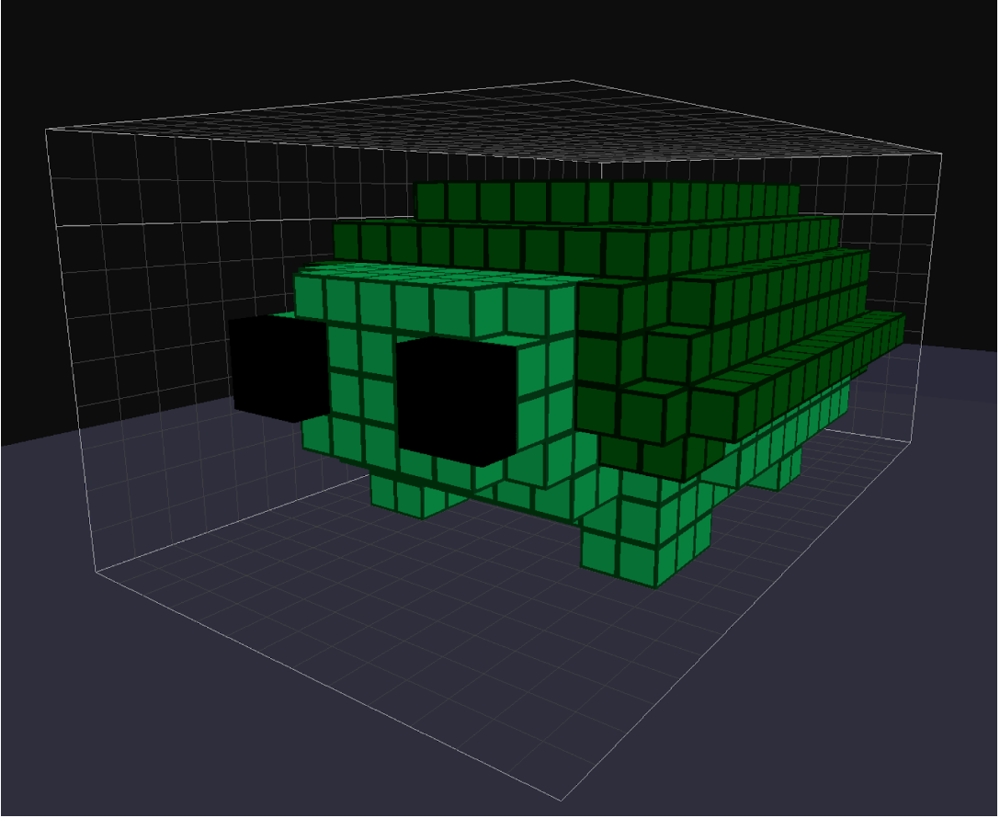

# Game Dev Blog 

## 3/4/23: Final blog of the term

### Overveiw

I was browsing the internet one lazy afternoon, and came across an interesting software. It was called RPG in a Box and is going to be what I am working on over the holidays probably.

### Unreal engine

I barely even opened Unreal engine all week

### RPG in a box

RPG in a Box is a software that you can use to create a lot of things, like levels, models, and items, and then put them together in your own game.

I started using it, tried out the premade demo game, and then tried to make a voxel model of a frog

It did not work out quite as I expected

But I made it waddle

I have it running through an animation that does these two frames between the frame of it standing still, and have a nice waddle cycle animation.

### My current idea

I came up with an idea for a game that I could create in RPG in a Box or some other one.

"A game where you have to run out of money"

You start with a certain amount of currency and you have to try to get to 0. Any lower and you lose. I was thinking of making it a puzzle game

### In Conclusion and plan for the Holidays

As this is the last blog of this term, I will not write a blog next week. I might get around to printing things in the holidays.

If I properly learn RPG in a Box over the holidays then I will write about it next term, but if i completly forget about RPG in a Box over the holidays then the tutorial will be finished.

This week was good, I am running out of steam for the term though.
