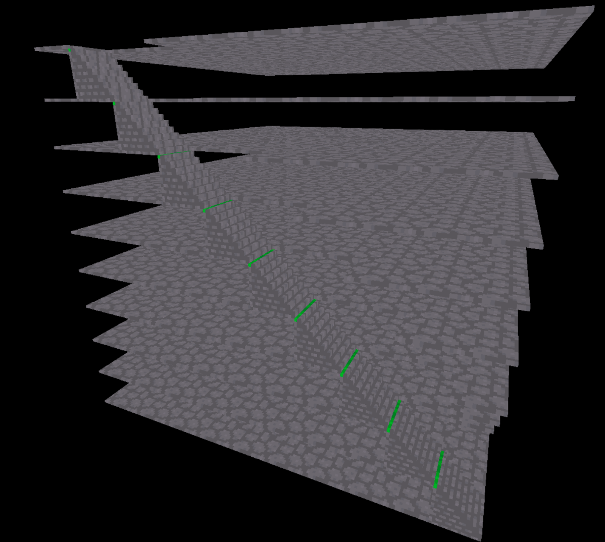

# Game Dev Blog 

## 1/5/23: First blog of term 2

### Overveiw

First blog of term 2. I improved my skills in RPG in a box over the holidays, and used them to implement stairs into a 10 layer building. Then I got the official Term Project on the first week of school.

### Project introduced

In the project, I will have to make a Game Design Document (GDD) and then Make a prototype and Present it, and it's processes to "a panel of education and industry specialists". Terrifying. 

### RPG in a box

Over the holidays I looked at some tutorials and looked at some examples. I figured out how to make the player character move up and down stairs and have all of the floors above them disappear. I do this by running a script whenever the character goes onto some stairsto make the floor the stair is on appear. I could also use this to make only the floor that the player is on appear.

'''c
hide_group("floor 5");
hide_group("floor 4");
hide_group("floor 3");
hide_group("floor 2");
show_group("floor 1");

'''c

### Current idea progress

By setting this up, I have now made it possible to have 20 unique 10 by 10 block levels, which makes my idea of a level based game much more feasable.

### In Conclusion and plan for Next Week

Last Blog I said that over the holidays I would either finish the UE tutorial or learn more RPG in a Box. This was both to give me some sort of goal over the holidays, and to determine the direction that my game is going to go in. The fact that I did more RPG in a box means that my actual project will probably also be using it.

I am probably going to be working on the GDD all of next week.
